  

---

## 👋 Sobre mim

Analista e Desenvolvedor de Sistemas em formação (Estácio), **desenvolvedor Backend**.

No trabalho, administro servidores Linux self-hosted e containers — o que me deu uma boa noção de como uma aplicação se comporta em produção. Agora estou trazendo essa bagagem para o outro lado: escrever a aplicação. Hoje isso significa Java, Spring Boot e bancos relacionais.

<b>🇺🇸 Read in English</b>

 

Systems Analysis & Development student (Estácio), transitioning from **IT/Infrastructure into Backend Development**.

At work I manage self-hosted Linux servers and containers, which gave me a solid feel for how an application behaves in production. Now I'm bringing that background to the other side: writing the application. Today that means Java, Spring Boot and relational databases.

---

## 🎯 Objetivo

Buscando minha **primeira oportunidade como Desenvolvedor Backend Java**. Enquanto isso, construo projetos práticos para consolidar o que aprendo — sempre com foco em código legível e boas práticas.

<b>🇺🇸 Read in English</b>

 

Looking for my **first opportunity as a Java Backend Developer**. In the meantime, I build hands-on projects to reinforce what I learn — always aiming for readable code and good practices.

---

## 🚀 Projeto em destaque

### [📚 ClassUp Backend](https://github.com/jotalts/classup-backend)

Backend do meu Trabalho de Conclusão de Curso: um sistema de gestão de turmas com **gamificação** (missões, conquistas e ranking) para aumentar o engajamento dos estudantes.

<b>🇺🇸 Read in English</b>

 

Backend of my capstone project: a classroom management system with **gamification** (missions, achievements and rankings) to boost student engagement.

---

## 🤖 Tecnologias

  
  &nbsp;&nbsp;
  
  &nbsp;&nbsp;
  
  &nbsp;&nbsp;
  
  &nbsp;&nbsp;
  
  &nbsp;&nbsp;
  
  &nbsp;&nbsp;
  
  &nbsp;&nbsp;
  

**Aprendendo agora:** Spring Security, testes automatizados (JUnit/Mockito) e Docker aplicado a aplicações Java.

<b>🇺🇸 Read in English</b>

 

**Currently learning:** Spring Security, automated testing (JUnit/Mockito) and Docker applied to Java applications.

---

### 📫 Vamos conversar?

